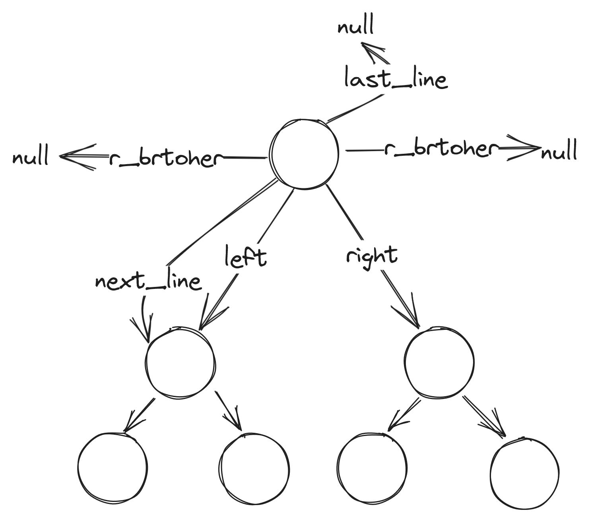
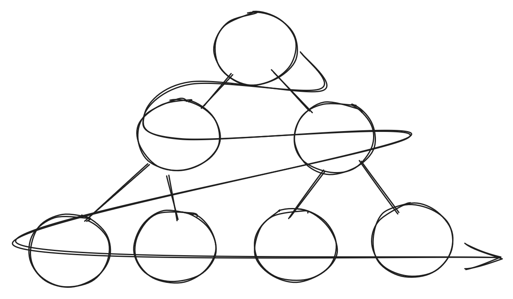

# erl_heap

链式存储的二叉堆（优先队列）Erlang NIF(Native Implemented Functions)

## 链式存储结构

```c
struct binary_tree_node
{
	int key;
	void* value;
	struct binary_tree_node* parent;
	struct binary_tree_node* left;
	struct binary_tree_node* right;
	struct binary_tree_node* r_brother;
	struct binary_tree_node* l_brother;
	struct binary_tree_node* old_brother;
	struct binary_tree_node* next_line;
	struct binary_tree_node* last_line;
};
```




采用了普通的树节点穿线的方式



对比顺序存储的方案，较为复杂和浪费空间，该方法为尝试链式存储的方式，并不是最优。

## 二叉堆算法

较为简单可以参考

https://oi-wiki.org/ds/binary-heap/

## CAPI
```c
static ERL_NIF_TERM new_tree_nif(ErlNifEnv* env, int argc, const ERL_NIF_TERM argv[])
```

新建一个树，返回一个不透明的Erlang对象，使用 Resource object 管理二叉堆的内存

对应 Erlang module API

```erlang
new_tree/0
```

```c
static ERL_NIF_TERM insert_nif(ErlNifEnv* env, int argc, const ERL_NIF_TERM argv[])
```

向树中插入一个对象， 有三个参数 key, value, tree

key: int 根据这个值进行排序（优先级）

value: tuple() 格式为 `{value, any()}` 可以放任意的Erlang对象

tree:  new_tree() 返回的树的不透明对象(其实是内存的指针或者引用)

返回值： {ok, tree_object_reference} 

```c
ERL_NIF_TERM delete_min_nif(ErlNifEnv* env, int argc, const ERL_NIF_TERM argv[])
```

从树中删除优先级最小的对象，并返回对象的 `key` `value`  如果为空 返回  `empty_heap`

参数 tree_object_reference 树的不透明对象

返回值：{{key,value}, tree_object} | {empty_heap, tree_object}

```c
static ERL_NIF_TERM delete_tree_nif(ErlNifEnv* env, int argc, const ERL_NIF_TERM argv[])
```

删除整个树，包括树的节点和树本身， 用于回收内存

参数 tree_object_reference

返回值：ok: atom()

```c
static ERL_NIF_TERM item_count_nif(ErlNifEnv* env, int argc, const ERL_NIF_TERM argv[])
```

返回当前树中对象的数量

```c
static ERL_NIF_TERM top_nif(ErlNifEnv* env, int argc, const ERL_NIF_TERM argv[])
```

查看当前树中的顶部元素（但不会删除）返回 key value
如果为空返回 null

返回值 {key, value}  | null

## 简单使用

1. 编译成名为`binary_heap.dll` 或者 `binary_heap.so`

2. 开始编写Erlang module 名为 binary_heap.erl

```erlang
-module(binary_heap).
-author("wangzihao").
-on_load(init/0).
%% API
-export([new_tree/0]).
-export([delete_min/1]).
-export([insert/3]).
-export([delete_tree/1]).
-export([item_count/1]).
-export([top/1]).

init() ->
  ok = erlang:load_nif("binary_heap", 0).

new_tree()->
  exit(nif_library_not_loaded).

insert(_K, _V, _Tree)->
  exit(nif_library_not_loaded).

delete_min(_Tree) ->
  exit(nif_library_not_loaded).

delete_tree(_Tree) ->
  exit(nif_library_not_loaded).

top(_Tree) ->
  exit(nif_library_not_loaded).

item_count(_Tree) ->
  exit(nif_library_not_loaded).
```

3. 可以使用shell测试一下

```erlang
5> T = binary_heap:new_tree().
#Ref<0.363979604.3798073347.70899> 
```

可以看到生成一个不透明对象

查看一下当前堆的情况

```erlang
9> binary_heap:top(T).
empty
10> binary_heap:item_count(T).
0
```

可以看到里面什么都没有

可以向里面插入值

```erlang
6> binary_heap:insert(1, {value, 1}, T).
{ok,#Ref<0.363979604.3798073347.70899>}
```

显示插入成功

多插入几个

```erlang
12> binary_heap:insert(-1, {value, 1}, T).
{ok,#Ref<0.363979604.3798073347.70899>}
13> binary_heap:insert(2, {value, 1}, T).
{ok,#Ref<0.363979604.3798073347.70899>}
14> binary_heap:insert(-3, {value, 1}, T).
{ok,#Ref<0.363979604.3798073347.70899>}

```

删除对象

```erlang
10> binary_heap:delete_min(T).
{{-3,1},#Ref<0.1485002331.607256581.110022>}
11> binary_heap:delete_min(T).
{{-1,1},#Ref<0.1485002331.607256581.110022>}
12> binary_heap:delete_min(T).
{{1,1},#Ref<0.1485002331.607256581.110022>}
13> binary_heap:delete_min(T).
{{2,1},#Ref<0.1485002331.607256581.110022>}
14> binary_heap:delete_min(T).
{empty_heap,#Ref<0.1485002331.607256581.110022>}
```

我们多删除了一个可以看到此时会提示 `empty_heap`

当我们打算释放掉堆

```
15> binary_heap:delete_tree(T).
ok
```

